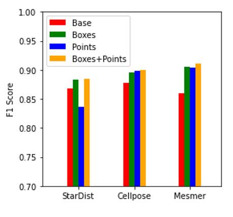

# Improving-cell-segmentation-for-spatial-omics 
## HTAN Data Jamboree Decemmber 4th-7th 2023 
## Problem statement 
Spatial data is widely used in biomedical research to investigate various aspects of biological systems such as identifying key cellular groups that coexist in a tissue during disease progression. Cell segmentation is a key preprocessing step for spatial data required to answer such biological question. Although there are various image segmentation tools available, they either require ground truth labels as part of algorithm training or do not generalize well to different datasets. Foundation models such as [Segment Anything Model](https://segment-anything.com/) are an active area of research that are aimed at tackling these challenges and perform self-supervised tasks on a large variety of datasets. One major advantage of SAM is that it does not require ground truth labels as part of its training to perform segmentation on a dataset, it can be initialized easily with prompts to guide the segmentation process. The goal of this project is to evaluate SAM's performance at cell-segmentation in tissuenet and HTAN CRC CycIF data using different kinds of prompts ('points' and 'bounding boxes') generated using specialized models such as [MESMER](https://www.deepcell.org/predict), [StarDist](https://github.com/stardist/stardist) and [Cellpose](https://www.cellpose.org/).

## Basic Workflow

## Code Description
1. segmentation_comparison.ipynb : This notebook is comparing segmentation performance of SAM when given prompts (points and bounding boxes) from MESMER, StarDist and Cellpose on 10 tissuenet images. 
2. MedSam.ipynb : This notebook is testing a different implementation of SAM - [MedSAM](https://github.com/bowang-lab/MedSAM) on a tissuenet image using prompts generated with Mesmer.
3. difficult_tissue_test.ipynb : This notebook is testing SAM with Mesmer-generated prompts on the HTAN CRC CyCIF data. We sampled a small, typically difficult-to-segment region with closely packes cells to evaluate SAM's performance qualitatively, showing how the MESMER mask is changed by SAM.
4. 
## Results
Improving specialized segmentation models with SAM:

MedSAM:

Testing Mesmer+SAM on difficult tissue:

## Tools used
1. SAM
2. Mesmer
3. Cellpose
4. StarDist
5. Skimage
6. matplotlib.pyplot
7. torch

## Team 
* Zac Sims (Oregon Health and Science University)
* Mark Wang (Oregon Health and Science University)
* Robert Heussner (Oregon Health and Science University)
* Melissa Chua (Stanford University)
* Anthony Lagnado (Mayo Clinic)
* Harsimran Kaur (Vanderbilt University)
